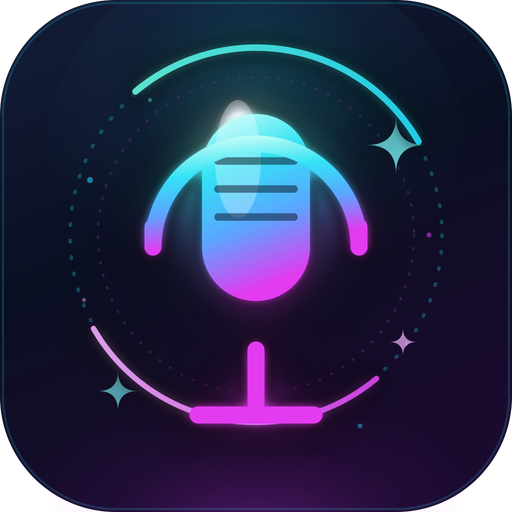

<p align="center">
  
</p>

<h1 align="center">🎤 Voice Input · 全局语音输入</h1>

<p align="center">
  按住快捷键说话，松开就把识别结果打到当前光标位置 · 中英文混说、自动加标点<br>
  SenseVoice 推理 + PySide6 托盘 GUI · 主攻 Linux/X11，并提供 Windows / macOS 原生安装包
</p>

<p align="center">
  
  
  
  =2.7">
  
  
</p>

## ✨ 特性

- 🎤 **按住说话，松开即输入** —— push-to-talk，识别结果自动打到光标处
- 🌏 **中英文混说 + 自动标点** —— SenseVoice 多语言识别
- ⚡ **极快** —— RTX 5060 实测 RTF ~0.02（说 5 秒约 0.1s 出字）
- 🖥️ **系统托盘 GUI** —— 三态图标 + 5 个 Tab 设置窗口
- 📝 **识别历史 + 热词增强** —— 专有名词识别更准
- 🚀 **开机自启 + 一键安装/卸载** —— `install.sh` / `uninstall.sh` 全自动

## 📸 界面预览

> 截图待补充。运行后把托盘 + 设置窗口截图放到 `assets/` 目录，并在此处引用：
> ``

## 开发 / 测试环境（作者实测）

- AMD Ryzen AI 7 H 350 / 30GB RAM
- RTX 5060 Laptop 8GB（Blackwell, sm_120, 需要 PyTorch ≥ 2.7 + CUDA 12.8）
- Ubuntu 22.04, X11

> ✅ **Linux + X11** 是一等公民（托盘 / 全局热键 / 文字注入体验完整，依赖 xdotool/xclip）。
> 🧪 **Windows / macOS** 已提供原生安装包（CPU 版，跨平台支持目前为实验性，欢迎反馈）。Linux 下 **Wayland** 暂未适配。

## 项目结构

```
voice_input/
├── core/                  ← 业务核心（无 GUI 依赖）
│   ├── config.py          ← 配置 ~/.config/voice-input/config.json
│   ├── logger.py          ← 日志 ~/.local/share/voice-input/logs/
│   ├── audio.py           ← 录音 + 音量回调
│   ├── recognizer.py      ← SenseVoice 推理 + 热词
│   ├── inject.py          ← 剪贴板粘贴（自动适配终端）
│   ├── hotkey.py          ← 全局快捷键
│   ├── history.py         ← 识别历史 ~/.local/share/voice-input/history.json
│   └── sound.py           ← 录音提示音（开始/结束 ding）
├── gui/                   ← PySide6 界面层
│   ├── icons.py           ← 动态生成三态托盘图标
│   ├── volume_meter.py    ← 实时音量条
│   ├── hotkey_capture.py  ← 自定义快捷键按钮
│   ├── settings_window.py ← 设置窗口（5 个 tab）
│   ├── tray_app.py        ← 托盘应用 + 状态机
│   └── autostart.py       ← systemd 自启管理
├── voice_input_gui.py     ← GUI 主入口（推荐）
├── main.py                ← CLI 入口（保留，无需 GUI 时用）
├── run_gui.sh             ← 启动 GUI
├── run.sh                 ← 启动 CLI（兼容老版本）
├── install_system_deps.sh ← 装 xdotool/xclip/portaudio
├── install_autostart.sh   ← 安装 systemd user service
└── setup_env.sh           ← 建 conda 环境 + 装 PyTorch/FunASR
```

## 安装

### 📦 方式一：下载原生安装包（推荐，开箱即用）

不用装 Python、不用配环境，到 [**Releases**](https://github.com/fnidore/voice-input/releases/latest) 下载对应平台的安装包即可：

| 平台 | 安装包 | 安装方式 |
|------|--------|----------|
| 🐧 Linux (X11) | `voice-input_*_amd64.deb` | `sudo dpkg -i voice-input_*.deb` |
| 🪟 Windows x64 | `voice-input-*-setup.exe` | 双击运行安装向导 |
| 🍎 macOS (Apple Silicon) | `voice-input-*.dmg` | 打开 dmg 拖入「应用程序」 |

> - 📥 首次运行会自动下载约 **1GB** 的 SenseVoice 模型（联网，存到 `~/.cache/modelscope`）。
> - 🧮 原生包内置 **CPU 版 PyTorch**；需要 **N 卡 GPU 加速**请用下方「方式二：从源码安装」。
> - 🍎 macOS 需在「系统设置 → 隐私与安全性 → 辅助功能 / 麦克风」授权后才能录音与模拟按键。
> - 🧪 Windows / macOS 包为跨平台支持，目前为实验性，遇到问题欢迎提 [Issue](https://github.com/fnidore/voice-input/issues) 反馈。

### 🛠️ 方式二：从源码安装（开发者 / 需要 GPU 加速）

#### 🐧 Linux (X11)

```bash
# 0) 克隆仓库
git clone https://github.com/fnidore/voice-input.git
cd voice-input

# 1) 系统依赖（一次性，要 sudo）
bash install_system_deps.sh

# 2) 建 conda 环境 + 装 PyTorch + FunASR + PySide6 （首次 10-20 分钟）
bash setup_env.sh

# 3) 启动 GUI
bash run_gui.sh
```

#### 🪟 Windows

```powershell
git clone https://github.com/fnidore/voice-input.git
cd voice-input
powershell -ExecutionPolicy Bypass -File install_windows.ps1
# 启动
.venv\Scripts\python voice_input_gui.py
```

#### 🍎 macOS

```bash
git clone https://github.com/fnidore/voice-input.git
cd voice-input
bash install_macos.sh
# 启动
.venv/bin/python voice_input_gui.py
```

> macOS 首次运行需在「系统设置 → 隐私与安全性 → 辅助功能」授权，pynput 才能模拟按键。

启动后会出现一个**麦克风图标**在系统托盘里：
- 灰色 = 待机
- 红色 = 录音中（按住 F4 时）
- 蓝色 = 识别中
- 红色 = 错误

**双击托盘图标** 打开设置窗口；**右键** 看菜单（暂停/重新加载模型/退出）。

## GUI 设置窗口（双击托盘）

5 个 Tab：

| Tab | 内容 |
|---|---|
| **基础** | 模型设备 (cuda:0/cpu)、语言、输入方式、麦克风（带音量条测试按钮）、提示音、开机自启 |
| **快捷键** | 自定义说话快捷键（点按钮捕获）、自定义粘贴键 |
| **热词** | 多行编辑，空格分隔，让识别更准（如 `涛涛鱼 SenseVoice 机械臂`） |
| **历史** | 最近 20 条识别结果，双击复制到剪贴板 |
| **日志** | 实时显示最后 200 行日志，方便排查 |

## 🧠 模型切换与自定义

设置 →「基础」→「识别模型」下拉，内置两个预设：

| 预设 | 适用 | 语言 | 热词 |
|------|------|------|------|
| **SenseVoice Small**（默认）| 中英日韩粤多语种、带情感事件、快 | 可选多语种 | 弱 |
| **Paraformer 中文**（SeACo）| 纯中文、标点干净、热词增强强 | 仅中文 | ✅ 强 |

**模型下载位置**：首次选用某模型时自动联网下载到 `~/.cache/modelscope/hub/models/`（约 1GB）。

**用自己的模型**：下拉选「📁 自定义模型」，在输入框填其一：
- **ModelScope 模型 ID**（如 `iic/xxx`）—— 自动从 [modelscope.cn](https://modelscope.cn) 下载
- **本地模型目录绝对路径** —— 用已下载好的 FunASR 兼容模型（点「浏览…」选目录）

> FunASR 兼容模型可在 [ModelScope](https://modelscope.cn/models) 或 [HuggingFace](https://huggingface.co/models) 搜索下载。自定义模型按通用方式调用，多语种/热词参数可能不生效。

**GPU 加速**：原生安装包内置 CPU 版 PyTorch，`cuda:0` 在 CPU 包会自动回退 cpu；需要 N 卡加速请用源码安装（见上方「方式二」）。

**中文热词输入**：打包版直接键盘输入中文受输入法插件限制，请从别处**复制后 Ctrl+V 粘贴**到热词框。

## 开机自启

打开 GUI 设置 → 基础 → 勾选「开机自启」→ 保存。

或者命令行：

```bash
# 启用自启 + 立即启动
bash install_autostart.sh

# 禁用
bash install_autostart.sh disable

# 完全卸载
bash install_autostart.sh remove

# 查状态
systemctl --user status voice-input.service

# 看日志
journalctl --user -u voice-input.service -f
```

## CLI 模式（不要 GUI 时用）

```bash
bash run.sh                          # 默认 F4 + cuda:0 + zh
bash run.sh --hotkey f9 --device cpu --language auto
bash run.sh --list-devices           # 列麦克风
bash run.sh --input-device 5         # 用 5 号麦克风
```

## 期望性能

| 模式 | RTF | 说 5 秒识别耗时 |
|---|---|---|
| RTX 5060 GPU | ~0.02 | ~0.1s |
| CPU (Ryzen H350) | ~0.1 | ~0.5s |

## 常见坑

**1. GUI 启动看不到托盘图标？**
GNOME 默认不显示传统托盘，要装扩展：
```bash
sudo apt install gnome-shell-extension-appindicator
# 然后到 https://extensions.gnome.org/ 启用 AppIndicator 扩展，注销重登
```

**2. systemd 服务起来但没界面？**
service 文件里默认 `DISPLAY=:1`，如果你的 X server 不是 `:1`，改 service 或 GUI 设置里的环境。
```bash
echo $DISPLAY        # 看实际值
# 编辑 ~/.config/systemd/user/voice-input.service 的 Environment=DISPLAY=...
systemctl --user daemon-reload && systemctl --user restart voice-input.service
```

**3. 录音爆音 / 削顶**
设置 → 基础 → 测试 5 秒看音量条。如果一直撞红，命令行调音量：
```bash
pactl set-source-volume @DEFAULT_SOURCE@ 25%
```

**4. PyTorch CUDA: False**
RTX 5060 Blackwell sm_120，必须 CUDA 12.8 + PyTorch ≥2.7。重跑 `setup_env.sh`。

**5. 模型下载失败**
ModelScope 国内很快，关掉代理重试即可。

**6. 终端粘贴不出字**
默认对 Tabby/GNOME Terminal/Alacritty 等都做了识别。冷门终端可在设置 → 快捷键 → 「终端粘贴键」改成 `shift+Insert`。

## 数据/配置位置

| 路径 | 内容 |
|---|---|
| `~/.config/voice-input/config.json` | 用户配置 |
| `~/.local/share/voice-input/history.json` | 识别历史 |
| `~/.local/share/voice-input/logs/voice-input.log` | 日志（滚动 5MB×5） |
| `~/.config/systemd/user/voice-input.service` | 自启 service 文件 |
| `~/.cache/modelscope/hub/models/iic/SenseVoiceSmall` | 模型权重 |

## 卸载

```bash
# 1. 关自启
bash install_autostart.sh remove

# 2. 退 GUI（右键托盘 → 退出）

# 3. 删数据（可选）
rm -rf ~/.config/voice-input ~/.local/share/voice-input

# 4. 删 conda 环境（可选）
conda env remove -n voice_input

# 5. 删项目目录
rm -rf voice-input
```

## ⭐ Star History

<a href="https://star-history.com/#fnidore/voice-input&Date">
  <picture>
    <source media="(prefers-color-scheme: dark)" srcset="https://api.star-history.com/svg?repos=fnidore/voice-input&type=Date&theme=dark" />
    <source media="(prefers-color-scheme: light)" srcset="https://api.star-history.com/svg?repos=fnidore/voice-input&type=Date" />
    
  </picture>
</a>

## 致谢

- [SenseVoice](https://github.com/FunAudioLLM/SenseVoice) / [FunASR](https://github.com/modelscope/FunASR) —— 语音识别模型
- [PySide6](https://doc.qt.io/qtforpython/) —— GUI 框架

## License

[MIT](./LICENSE) © 2026 fnidore
